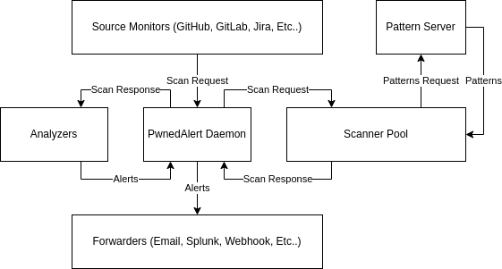

# Architecture

## The Problem

The Leak Tool Kit (LeakTK) aims to be a comprehensive leak framework
addressing:

* [Detection](GLOSSARY.md#detection)
* [Mitigation](GLOSSARY.md#mitigation)
* [Prevention](GLOSSARY.md#prevention)

In a way that meets these project goals:

* Open & Free
* Self-Hostable & Customizable
* Developer Tooling Supports Privacy By Design
* Monitors Many Sources (not just git)
* Integrates Into Existing Processes
* Blazingly Fast!
* User Friendly

Many existing tools do bits and pieces of this really well. Some of those will
probably be leveraged directly by LeakTK. This project is an attempt to combine
existing tools with new ones to meet the goals stated above.

## Design

Here's some diagrams of how the components are expected to work together.
Details about each component can be found in the components section below.

### PwnedAlert

PwnedAlert is a collection of Source Monitors, Scanners, Analyzers and
Forwarders that communicate through a central daemon.

([Diagram Source](assets/PwnedAlert.drawio))

### Pre-Commit Hook

TODO: Diagram - leverages the scanner directly within a repo

### Repo Cleaners

TODO: Diagram - takes a scan result and preforms actions directly on it.

## Components

Unless otherwise noted, assume each component takes its input via stdin and
returns output to stdout and logs to stderr. In most (if not all) cases the
message output will be in [jsonl format](https://jsonlines.org/). If there is a
desire to network components, an additional component should be introduced to
handle that.

The idea is to make these components composable. For example if scan requests
need to be sent over HTTP, a server component could be spun up that wraps a
scanner pool to handle requests and responses.

### Analyzers

Analyzers take scan results, analyze them, and generate alerts. They may verify
leaks, filter existing items out, add/remove tags from the alerts, etc.

An alert SHOULD have all of the same fields as a scan result, but an analyzer
MAY alter the information in a field. It MAY also add additional fields.

An analyzer MAY not generate an alert for a result, or it MAY generate multiple
alerts per a result. Each alert should be its own message.

### Forwarders

Forwarders take the alerts, formats them, optionally group them, and sends
them to an external source like a SIEM, sends an email, etc. These aren't
expected to have any stdout.

### Source Monitors

Source Monitors watch sources for changes. When a change happens, it emits a
source event.

A few examples of monitors:

* Watch the GitHub event stream for changes and checks it against a list of
  known repos it's watching
* Take the list of known repos and iterate through them to look for changes
  since the last scan
* Look for changes in public Jira tickets
* Look for public Bugzilla tickets
* Look for changes in web pages

### Pattern Server

The Pattern Server is a HTTP server that returns leak patterns for the scanner
to use. This may or may not be authenticated depending on the pattern server
used. This allows fresh patterns to be distributed to the scanner without
having to redeploy it. It also provides a way to return filtered views of
patterns to the scanner if supported.

At a minimum any HTTP server can be a pattern server, but there will be a
pattern server component to this project that provides role based access and
pattern filtering options.

### PwnedAlert Daemon

The PwnedAlert Daemon manages all of the other process and acts as a message
broker. It routes traffic handles the logs and keeps everything going.

### Scanner Pool

The Scanner Pool is a collection of LeakTK Scanners meant to handle multiple
source types and integrates with the pattern server to keep a fresh set of leak
patterns. This is meant to provide a stable, consistent interface to other
existing scanners (e.g. gitleaks, maybe yara, etc).

The scanner will also make "smart" decisions about its requests to increase
performance. In some cases it may increase the scan scope to avoid errors.  For
example switching to no single branch if the provided branch doesn't exist.
