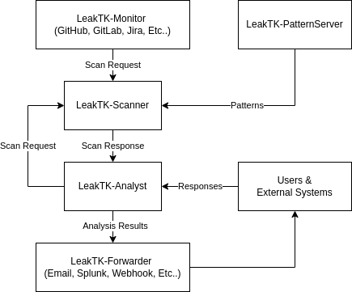

# Architecture

## The Problem

The Leak Tool Kit (LeakTK) aims to address the challenges of detecting,
mitigating, and preventing secrets leaks through a comprehensive framework that
is:

* Open & Free
* Self-Hostable
* Customizable
* Privacy Conscious
* Able to Monitor Many Sources (not just Git)
* Interoperable with Existing Processes
* Fast
* User Friendly

Many existing tools address some aspects of this well. This project combines
existing and new tools to achieve the goals stated above.

## Components

Unless otherwise noted, each component receives input via stdin, provides
output via stdout, and logs via stderr. In most or all cases, the message
output will be in [JSONL format](https://jsonlines.org/) to facilitate
integration with existing tools. To network components, an additional component
should be introduced.

For example, to send scan requests via HTTP, a server component could wrap a
scanner pool to handle requests and responses.

Here is an example of how the components below could be integrated for a
detection and monitoring solution:

### LeakTK-Monitor

**STATUS**: Internal implementation being open sourced

**Purpose:** LeakTK-Monitor monitors configured sources for changes, determines
if and how much of a source needs to be scanned, and initiates scan requests.

Examples of monitors:

* Watch the GitHub event stream for changes
* Check a list of known repositories for changes since the last scan
* Look for changes in Jira tickets
* Look for changes in Bugzilla tickets
* Look for changes in web pages

*Relationship to other components:* LeakTK-Monitor sends scan requests to
LeakTK-Scanner.

### LeakTK-Scanner

**STATUS**: Active & Open Source

**Purpose:** LeakTK-Scanner is a stateless scanner that accepts scan requests,
retrieves patterns from a pattern server, and produces scan results.

*Relationship to other components:* LeakTK-Scanner receives scan requests from
LeakTK-Monitor and patterns from LeakTK-PatternServer, and sends results to
LeakTK-Analyst.

### LeakTK-Patterns

**STATUS**: Active & Open Source

**Purpose:** LeakTK-Patterns is a curated set of secret detection patterns for
the scanner.

*Relationship to other components:* LeakTK-Patterns provides the data used by
the LeakTK-PatternServer.

### LeakTK-PatternServer

**STATUS**: Internal implementation being open sourced

**Purpose:** LeakTK-PatternServer provides filtered views of detection patterns
based on use case and user permissions.

Example filter use cases:

- RBAC for patterns access
- Preprod vs prod patterns
- Pattern testing groups

*Relationship to other components:* LeakTK-PatternServer provides patterns to
LeakTK-Scanner.

### LeakTK-Analyst

**STATUS**: Partial internal implementation

**Purpose:** LeakTK-Analyst is the SOAR (Security Orchestration, Automation and
Response) component that verifies scan findings and automates mitigation.

*Relationship to other components:* LeakTK-Analyst receives scan results from
LeakTK-Scanner and sends requests to LeakTK-Forwarder.

### LeakTK-Forwarder

**STATUS**: Internal implementation being open sourced

**Purpose:** LeakTK-Forwarder enables LeakTK-Analyst to send information to
other systems or users.

*Relationship to other components:* LeakTK-Forwarder receives requests from
LeakTK-Analyst.

### LeakTK-GitHooks

**STATUS**: Internal implementation being open sourced

**Purpose:** LeakTK-GitHooks is a set of Git hooks for preventing leaks and
providing teams with management and auditing tools.

Hooks:

* pre-commit - Scan for secrets and block commits if detected.
* commit-msg - Attest pre-commit usage for auditability.

*Relationship to other components:* LeakTK-GitHooks interacts with the Git
workflow.

### LeakTK-Mitigator

**STATUS**: Not Started (may become a part of LeakTK-Analyst)

**Purpose:** LeakTK-Mitigator processes input from the scanner or analyst and
mitigates leaks.

Mitigations:

* Invalidating Secrets
* Redaction/Encryption

*Relationship to other components:* LeakTK-Mitigator receives input from
LeakTK-Scanner or LeakTK-Analyst. It is often ran by a user with access to
preform the mitigation.
